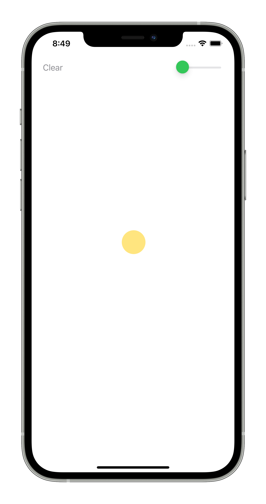
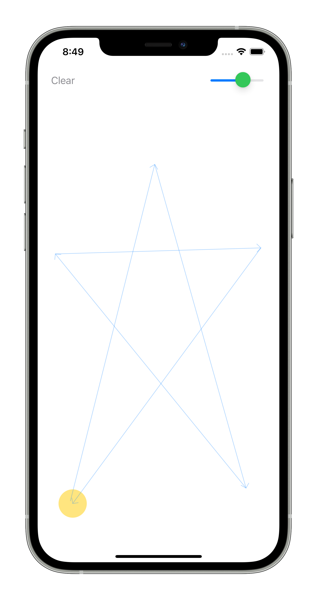

# Mad Circle

Test task for JetBrains Internships 2021

## Description
* When you tap on the screen, the circle moves to the place of the tap
* With several consecutive clicks - the object moves alternately along all the clicked points
* A slider is displayed in the upper right corner to control the speed of movement

## Sneak Peek
Move the Circle by Touch | Be Inspired
:-----------------------:|:-------------:
 | 
